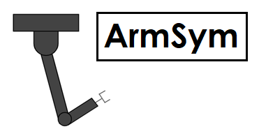
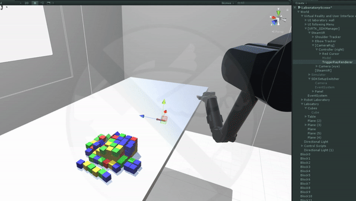

####  A testbed for human-robot control scientific experiments in VR

ArmSym is:

* Written in Unity and C#.
* Open source. 
* Compatible with the HTC Vive headset and trackers.

Welcome! 

###### ArmSym is work in progress - new features and tutorials will be added over time!

## ArmSym

#### What is ArmSym?

ArmSym,  stylized for 'arm simulation', is a Unity project for the HTC Vive.  We have created a simulation of the 7 degrees-of-freedom [Barrett WAM robotic arm](http://brain-computer-interfaces.net/) that features a trial-based system, a data management pipeline, and a user interface. The project is customizable, and permits interaction with biosignals via [Lab Streaming Layer](https://github.com/sccn/labstreaminglayer). 

#### Who can use ArmSym?

We release the code with the aim of helping researchers design experiments in which a human controls and interacts with a robotic arm. We target scientists who work on high-level upper limb prosthesis control or assistive robotic manipulators mounted on wheelchairs. We do not intend ArmSym's as a clinical tool. 

We also believe ArmSym could be used as a learning or demonstrative tool for robot learning and human-robot interaction communities.  

#### Who is behind the project?

[Section deleted for review]

#### The box an blocks test

We release with ArmSym a virtual version of the box and blocks test of manual dexterity. Included are:

* Tutorials for researchers in the folder 'Documentation'.
* A basic toolbox for control in the script *'armsym_robot.cs'*.
* Three *off-the-shelf* high-level control setups, one for prosthesis mimicking (control mode 0), one for arm imitation also known as inverse kinematics (control mode 1) and a master/slave order system (control mode 2). 
* Compatibility with the HTC vive controller and trackers.
* Hand control.
* A data management system. 

#### Requirements
ArmSym requires a computer [capable of running VR](https://store.steampowered.com/app/323910/SteamVR_Performance_Test/) . We strongly suggest using a good graphics card for Unity and the experiments. GTX 1070/1080 are a good fit. 

We also suggest using Unity 2017.3 or older.

#### License

Please refer to the [MIT License](LICENSE) . 
ArmSym uses a series of dependencies, which have licenses of their own.

###### Dependencies:
Distributed with ArmSym are the following dependencies:

* SteamVR, a well known software developement kit for the HTC Vive in Unity
  (SteamVR SDK, Valve Corporation, Bellevue, US).
* MathNet.Numerics, a C# library that includes linear algebra support 1
* VRTK, a toolkit for VR objects and scripts in Unity.
* LSL4Unity, a toolbox that allows Unity to communicate with streams of lab
  streaming layer (LSL). This is a very useful platform for streaming signals,
  biosignals and, in our case, markers.
